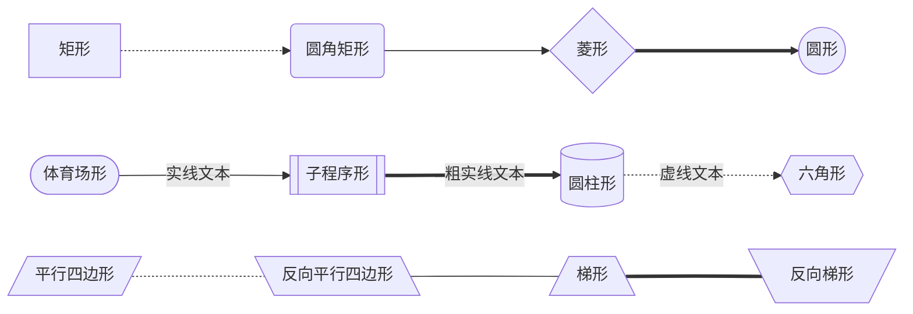

# myRepo

```mermaid
graph LR
A[矩形] -.->B(圆角矩形) --> C{菱形} ==> D((圆形)) 
E([体育场形])--实线文本--> F[[子程序形]]==粗实线文本==>G[(圆柱形)]-.虚线文本.->H{{六角形}}
I[/平行四边形/]-.-J[\反向平行四边形\]---K[/梯形\]===L[\反向梯形/]

```

```mermaid
graph LR
    A(用户) --> B[获取预签名URL或临时密钥(企业后端)]
    A --> C[[直接上传或下载文件(火山对象存储TOS)]]
```
